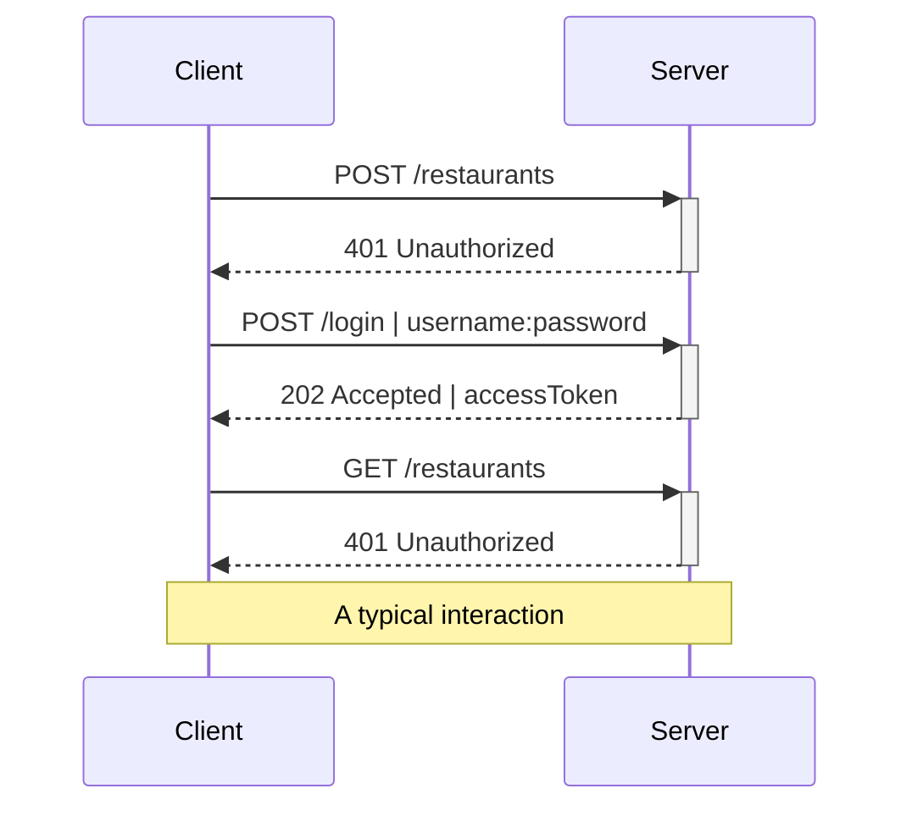

---
# try also 'default' to start simple
theme: default
title: Foodev
titleTemplate: '%s - SOA'
# random image from a curated Unsplash collection by Anthony
# like them? see https://unsplash.com/collections/94734566/slidev
# https://unsplash.com/collections/3JDsDM8qmaI/slidev
# https://unsplash.com/collections/7pU-FOuzi98/%E5%B9%BB
#
# background: https://source.unsplash.com/collection/3JDsDM8qmaI/1920x1080
background: https://source.unsplash.com/collection/4625880/1920x1080

highlighter: shiki
# show line numbers in code blocks
lineNumbers: false
# some information about the slides, markdown enabled
# persist drawings in exports and build
drawings:
  persist: false
# use UnoCSS (experimental)
css: unocss
#
layout: cover
# image: 'https://source.unsplash.com/collection/94734566/1920x1080'
# apply any windi css classes to the current slide
class: text-center
---

<div class="bg-black w-full right-0 absolute bg-opacity-40 shadow-lg">
<!-- <h1>Foo<span class="text-sky-500">dev</span></h1> -->

# Foo<span class="text-sky-500">dev</span>

Architetture Orientate ai Servizi - 2022

Matteo Azzolini
</div>

<!-- <style>
.cover {
  @apply bg-opacity-100;
  background-color: #2B90B6;
  background-image: linear-gradient(45deg, #4EC5D4 10%, #146b8c 20%);
  background-size: 50%;
}
</style> -->

---

## Introduzione

La presentazione è composta da **tre parti**:

1. Requisiti

2. Progettazione API
    - Risorse
    - Autenticazione
    - Esempio di chiamata

3. Implementazione
    - koa js
    - jest

---

## Codice

Il codice sorgente è consultabile su **github**: 

https://github.com/matteo-azzolini/soa-exam-koa

https://github.com/matteo-azzolini/soa-exam-slide

---
layout: center
---

# Requisiti

---

<Header>Requisiti</Header>

## Foodev

<br>

Foodev è una semplice **rest Api** che permette di ordinare da casa dal proprio ristorante preferito

<br>

***

<br>

Deve gestire **due tipologie** di utenti:
- i proprietari - <sky>owner</sky> - possono inserire e modificare il proprio ristorante e il menu
- i clienti - <sky>customer</sky> - possono effettuare ordini in un particolare ristorante selezionando i piatti desiderati

---

<Header>Requisiti</Header>

## Accesso alle risorse

<br>

È necessario possedere un'utenza valida e **autenticarsi** per poter richiamare le api.

Un'utente può modificare solo le **proprie** risorse

<small>(e.g. un proprietario può modificare solo un ristorante in suo possesso\, un cliente non può modificare ristoranti)</small>

---
layout: center
---

# Progettazione API

---
layout: image-right
image: https://source.unsplash.com/collection/4625880/1920x1080
---

<Header>Api design</Header>

## Risorse

- utenti
  - 🧑🏻‍🍳 proprietari
  - clienti
- 🍽 ristoranti
- 🍜 piatti
- 📋 ordini

---

<Header>Api design / AUTH</Header>

## Registrazione utente

<br>

È possibile <sky>registrare</sky> un utente tramite una chiamata all'endpoint <mono>/register</mono>

<br>

#### <Post /> /register

<div class="w-1/2">
```json
{
  "username": "xxx",
  "password": "yyy",
  "role": "OWNER"
}
```
</div>

<br>

L'utente viene salvato insieme alla sua **password** ( *hash + salt* ) e al suo **ruolo**

---

<Header>Api design / AUTH</Header>

## Login

<br>

È possibile ottenere un <sky>token di accesso</sky> alle api tramite una chiamata all'endpoint <mono>/login</mono>\
con **Basic authentication** (username:password)

<br>

<div class="flex space-x-6">

<div class="w-1/2">

#### <Post /> /login

```json
{
  "username": "xxx",
  "password": "yyy"
}
```
</div>

<div class="w-1/2">

#### 202 Accepted

```json
{
  "accessToken": "JWT /header/./data/./signature/"
}
```
</div>

</div>

<br>

In caso la login abbia successo viene ritornato all'utente un **access_token**, in formato **JWT**, che sarà utilizzato per effettuare le successive richieste

---

<Header>Api design / AUTH</Header>

## Autenticazione

<br>

È possibile <sky>autenticarsi</sky> in ogni chiamata all'api inserendo l'access_token JWT all'interno del HTTP request header <mono>Authorization</mono>

<div class="w-1/2">

```
GET /restaurants
Authorization: Bearer $access_token_jwt
```

</div>

---
layout: two-cols-header
---

<Header>Api design / AUTH</Header>

## Autorizzazione

<br>

::left::

<sky>JWT</sky> - JSON Web Token - è un token di accesso standardizzato che consente lo scambio sicuro di dati tra due parti

Permette di gestire il **controllo degli accessi** alle risorse senza dover gestire sessioni e scaricando l'onere al client

In slidev il JWT generato contiene l'**id** e il **ruolo** dell'utente, da cui si può determinare se l'utente <sky>ha accesso</sky> a una determinata risorsa

::right::

##### Esempio JWT in slidev

```json
// HEADER
{ 
  ..
}
// DATA
{ 
  "id": "123",
  "role": "OWNER"
}
// SIGNATURE
{ 

}
```

---

TODO non estrae!



<v-click>

## Risorse

<br>

- Ristoranti
- Piatti
- Ordini

</v-click>

---

<Header>Api design / Resources</Header>

## Ristoranti

| Metodo      | Url               | Owner              | Customer  |
| ----------- | ----------------- | ------------------ | --------- |
| <Get />     | /restaurants      | <Allow />          | <Allow /> |
| <Get />     | /restaurants/:id  | <Allow />          | <Allow /> |
| <Post />    | /restaurants      | <Allow />          | <Deny />  |
| <Put />     | /restaurants/:id  | <Allow note="1" /> | <Deny />  |
| <Delete />  | /restaurants/:id  | <Allow note="1" /> | <Deny />  |

<div class="absolute bottom-6 right-6">
  <small class="font-base">1 - solo se proprietario del ristorante</small>
</div>

---

<Header>Api design / Resources</Header>

## Piatti

| Metodo      | Url                 | Owner     | Customer  |
| ----------- | ------------------- | --------- | --------- |
| <Get />     | /meals?restaurantId | <Allow /> | <Allow /> |
| <Get />     | /meals/:id          | <Allow /> | <Allow /> |
| <Post />    | /meals              | <Allow /> | <Deny />  |
| <Put />     | /meals/:id          | <Allow /> | <Deny />  |
| <Delete />  | /meals/:id          | <Allow /> | <Deny />  |

---

<Header>Api design / Resources</Header>

## Ordini

| Metodo      | Url                  | Owner              | Customer           |
| ----------- | -------------------- | ------------------ | ------------------ |
| <Get />     | /orders              | <Allow note="1" /> | <Allow note="2" /> |
| <Get />     | /orders/:id          | <Allow note="1" /> | <Allow note="2" /> |
| <Post />    | /orders              | <Deny />           | <Allow />          |

<div class="absolute bottom-6 right-6">
  <small class="font-base">1 - ordini dei propri ristoranti</small>
  <br>
  <small class="font-base">2 - ordini effettuati dal cliente</small>
</div>

---
layout: two-cols
---

<Header>Api design / Request example</Header>

# Sequence diagram

::right::


---
layout: two-cols-header
---

<Header>Api design / Request example</Header>

## <span class="text-emerald-500">POST</span> /restaurant

::left::

Request:

```json {all|0}
  {
    "name": "Pizza giusta",
    "owner": "Bastianovic",
    "meals": [
      "meals/123"
    ]
  }
```

::right::

<v-click>

Response:

```json {all|2}
  {
    "id": 123,
    "name": "Pizza giusta",
    "owner": "Bstianovic",
    "meals": []
  }
```

</v-click>

---
layout: two-cols-header
---

<Header>Api design / Request example</Header>

## <span class="text-sky-500">GET</span> /restaurant/123

::left::

Risposta:

```json
  {
    "id": 123,
    "name": "Pizza giusta",
    "meals": []
  }
```

---
layout: two-cols-header
---

<Header>Api design / Request example</Header>

## <span class="text-amber-500">PUT</span> /restaurant/123

::left::

Request:

```json {all|0}
  {
    "name": "Pizza giusta 2.0",
    "meals": [
      "meals/123"
    ]
  }
```

::right::

<v-click>

Response:

```json {all|3,5-7}
  {
    "id": 123,
    "owner": "user/555",
    "name": "Pizza giusta 2.0",
    "meals": [
      "meals/123"
    ]
  }
```

</v-click>

---
layout: center
---

# Implementazione

---

# Tech stack

- koa js

---

# App.js

```typescript {all|1-2|4-7|8-11}
const app = new koa();
const router = new koaRouter();

app
  .use(logger())
  .use(router.routes())
  .use(router.allowedMethods());

router.get('/restaurants',      getRestaurants);
router.get('/restaurants/:id',  getRestaurants);
router.post('/restaurants',     createRestaurant(request));

const options = {
  key: fs.readFileSync('cert/key.pem'),
  cert: fs.readFileSync('cert/cert.pem')
};

http.createServer(app.callback()).listen(80);
https.createServer(options, app.callback()).listen(443);
```

---
layout: center
class: text-center
---

# Demo

[Documentations](https://sli.dev) · [GitHub](https://github.com/slidevjs/slidev) · [Showcases](https://sli.dev/showcases.html)
