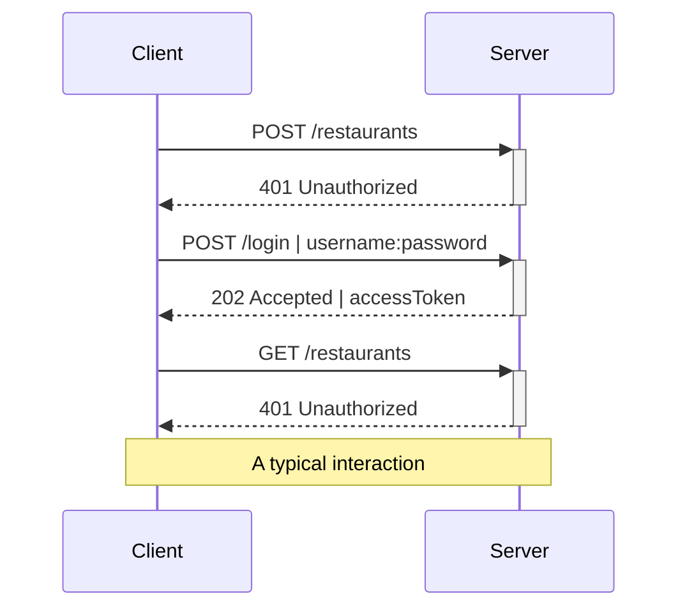

<Header>Api design / AUTH</Header>

## Registrazione utente

<br>

È possibile <sky>registrare</sky> un utente tramite una chiamata all'endpoint <mono>/register</mono>

<br>

#### <Post /> /register

<div class="w-1/2">
```json
{
  "username": "xxx",
  "password": "yyy",
  "role": "OWNER"
}
```
</div>

<br>

L'utente viene salvato insieme alla sua **password** ( *hash + salt* ) e al suo **ruolo**

---

<Header>Api design / AUTH</Header>

## Login

<br>

È possibile ottenere un <sky>token di accesso</sky> alle api tramite una chiamata all'endpoint <mono>/login</mono>\
con **Basic authentication** (username:password)

<br>

<div class="flex space-x-6">

<div class="w-1/2">

#### <Post /> /login

```json
{
  "username": "xxx",
  "password": "yyy"
}
```
</div>

<div class="w-1/2">

#### 202 Accepted

```json
{
  "accessToken": "JWT /header/./data/./signature/"
}
```
</div>

</div>

<br>

In caso la login abbia successo viene ritornato all'utente un **access_token**, in formato **JWT**, che sarà utilizzato per effettuare le successive richieste

---

<Header>Api design / AUTH</Header>

## Autenticazione

<br>

È possibile <sky>autenticarsi</sky> in ogni chiamata all'api inserendo l'access_token JWT all'interno del HTTP request header <mono>Authorization</mono>

<div class="w-1/2">

```
GET /restaurants
Authorization: Bearer $access_token_jwt
```

</div>

---
layout: two-cols-header
---

<Header>Api design / AUTH</Header>

## Autorizzazione

<br>

::left::

<sky>JWT</sky> - JSON Web Token - è un token di accesso standardizzato che consente lo scambio sicuro di dati tra due parti

Permette di gestire il **controllo degli accessi** alle risorse senza dover gestire sessioni e scaricando l'onere al client

In slidev il JWT generato contiene l'**id** e il **ruolo** dell'utente, da cui si può determinare se l'utente <sky>ha accesso</sky> a una determinata risorsa

::right::

##### Esempio JWT in slidev

```json
// HEADER
{ 
  ..
}
// DATA
{ 
  "id": "123",
  "role": "OWNER"
}
// SIGNATURE
{ 

}
```

---

TODO non estrae!



<v-click>

## Risorse

<br>

- Ristoranti
- Piatti
- Ordini

</v-click>
