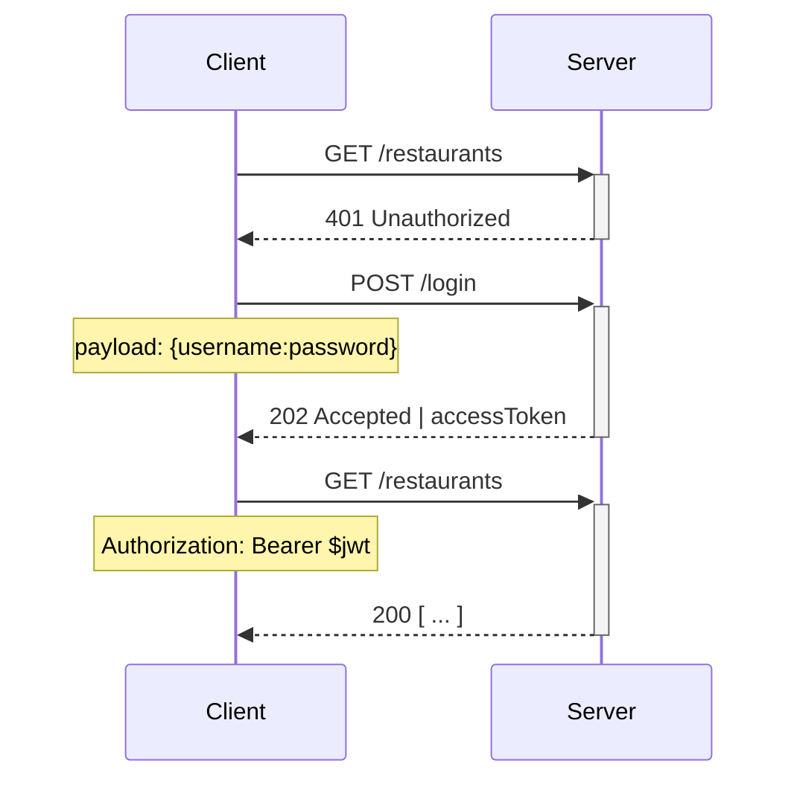

<Header>Progettazione Api / Esempio chiamata</Header>

## Flusso autenticazione

::left::

Esempio di flusso di autenticazione con recupero dell'<mono>access_token</mono> jwt

::right::



---
layout: two-cols-header
---

<Header>Progettazione Api / Esempio chiamata</Header>

## <span class="text-emerald-500">POST</span> /restaurant

::left::

Request:

```json {all|0}
  {
    "name": "Pizza giusta",
  }
```

::right::

<v-click>

Response:

```json {all|2,3}
  {
    "id": 123,
    "owner": "user/555",
    "name": "Pizza giusta",
    "meals": []
  }
```

</v-click>

---
layout: two-cols-header
---

<Header>Progettazione Api / Esempio chiamata</Header>

## <span class="text-sky-500">GET</span> /restaurant/123

::right::

Response:

```json
  {
    "id": 123,
    "owner": "user/555",
    "name": "Pizza giusta",
    "meals": []
  }
```

---
layout: two-cols-header
---

<Header>Progettazione Api / Esempio chiamata</Header>

## <span class="text-amber-500">PUT</span> /restaurant/123

::left::

Request:

```json {all|0}
  {
    "name": "Pizza giusta 2.0",
    "meals": [
      "meals/123"
    ]
  }
```

::right::

<v-click>

Response:

```json {all|4,5-7}
  {
    "id": 123,
    "owner": "user/555",
    "name": "Pizza giusta 2.0",
    "meals": [
      "meals/123"
    ]
  }
```

</v-click>

---
layout: two-cols-header
---

<Header>Progettazione Api / Esempio chiamata</Header>

## <span class="text-rose-500">DELETE</span> /restaurant/123

::right::

Response:

```
200 OK
```

---
layout: two-cols-header
---

<Header>Progettazione Api / Esempio chiamata</Header>

## HTTP Response status code

Codici di stato delle risposte HTTP gestiti:

<br>

::left::

| Codice              | Messaggio   |
| ------------------- | ----------- |
| <green>200</green>  | OK          |
| <green>201</green>  | Created     |
| <green>202</green>  | Accepted    |
| <green>204</green>  | No Content  |

::right::

| Codice          | Messaggio             |
| --------------- | --------------------- |
| <red>400</red>  | Bad Request           |
| <red>401</red>  | Unauthorized          |
| <red>403</red>  | Forbidden             |
| <red>404</red>  | Not Found             |
| <red>405</red>  | Method Not Allowed    |
| <red>500</red>  | Internal Server Error |

<style>
.slidev-layout td {
  @apply py-2;
}

green {
  @apply text-emerald-500;
}
red {
  @apply text-rose-400;
}
</style>