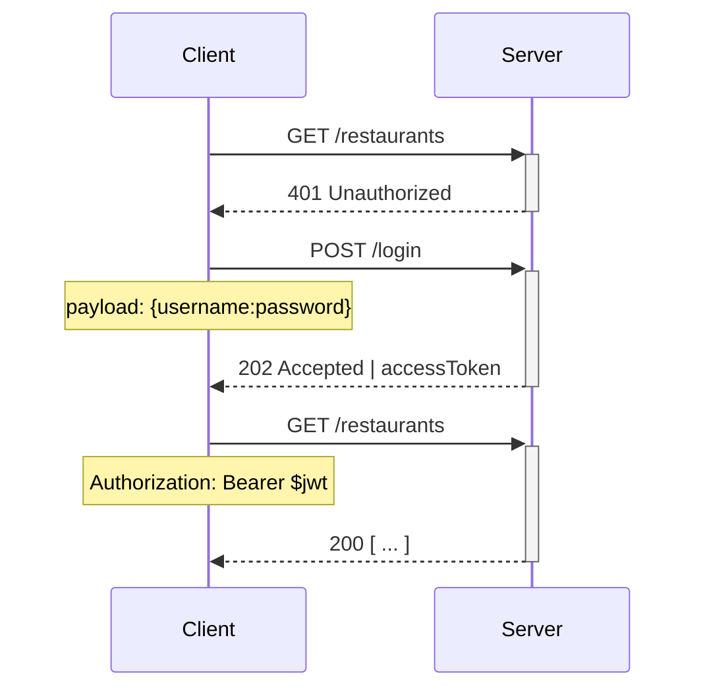

<Header>Api design / Request example</Header>

## Sequence diagram

::right::



---
layout: two-cols-header
---

<Header>Api design / Request example</Header>

## <span class="text-emerald-500">POST</span> /restaurant

::left::

Request:

```json {all|0}
  {
    "name": "Pizza giusta",
  }
```

::right::

<v-click>

Response:

```json {all|2,4  }
  {
    "id": 123,
    "name": "Pizza giusta",
    "owner": "user/123",
    "meals": []
  }
```

</v-click>

---
layout: two-cols-header
---

<Header>Api design / Request example</Header>

## <span class="text-sky-500">GET</span> /restaurant/123

::right::

Response:

```json
  {
    "id": 123,
    "name": "Pizza giusta",
    "owner": "user/555",
    "meals": []
  }
```

---
layout: two-cols-header
---

<Header>Api design / Request example</Header>

## <span class="text-amber-500">PUT</span> /restaurant/123

::left::

Request:

```json {all|0}
  {
    "name": "Pizza giusta 2.0",
    "meals": [
      "meals/123"
    ]
  }
```

::right::

<v-click>

Response:

```json {all|4,5-7}
  {
    "id": 123,
    "owner": "user/555",
    "name": "Pizza giusta 2.0",
    "meals": [
      "meals/123"
    ]
  }
```

</v-click>
